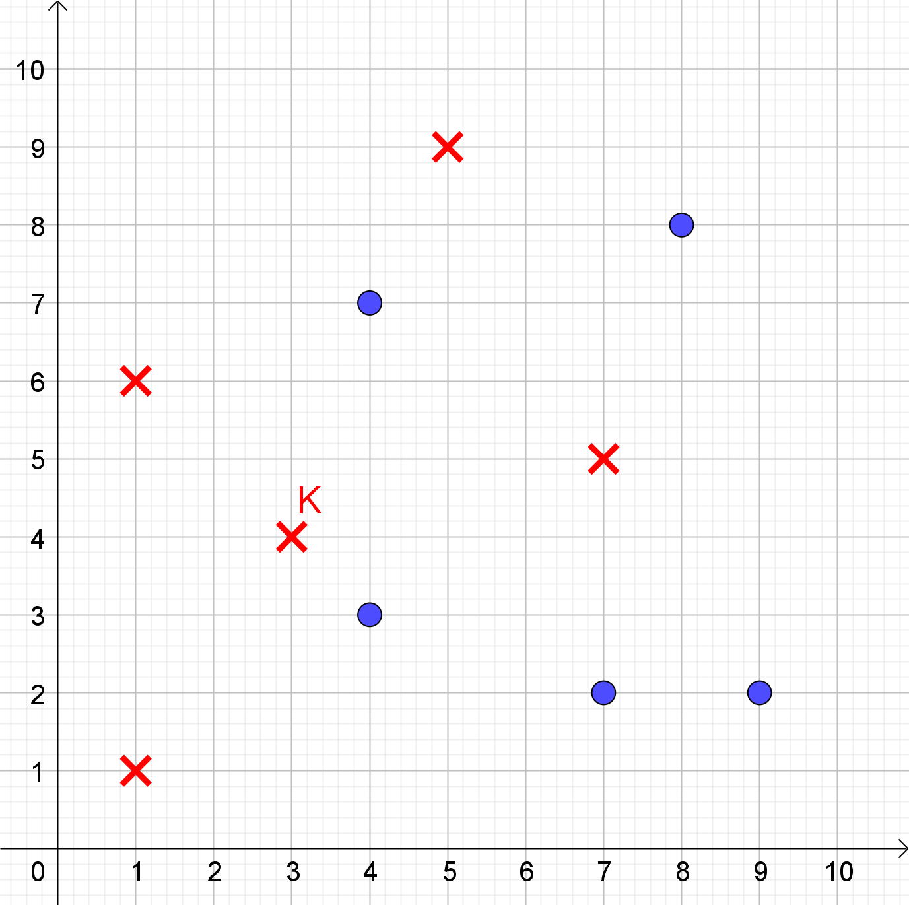
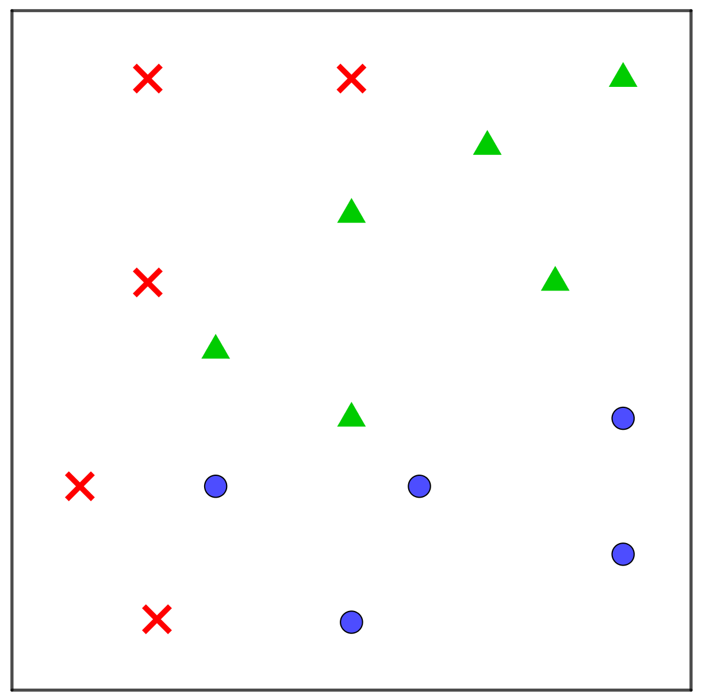
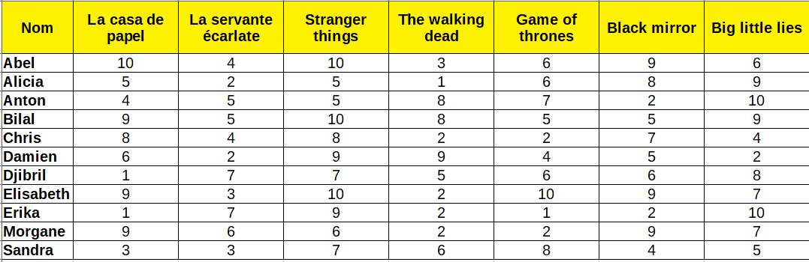

# Exercices sur l’algorithme k-NN

## Exercice 1

On considère des points représentés par un cercle ou une croix,
représentés sur la figure ci-dessous.

  

Les coordonnées d’un point sont ses attributs, et sa représentation
graphique (*cercle* ou *croix*) est sa classe. Ainsi le point \(K\) a
pour attributs \((3;4)\) et pour classe *croix*.

1.  En appliquant l’algorithme 1-NN, attribuer une classe parmi *cercle*
    ou *croix* aux points suivant :
    
    \(A(1;8)\), \(B(5;5)\), \(C(6;3)\), \(D(6;8)\) et \(E(9;6)\)

2.  Même chose avec l’algorithme 3-NN.

3.  Même chose avec l’algorithme 5-NN.

## Exercice 2

On considère des points représentés par un cercle, un triangle ou une
croix, représentés sur la figure ci-dessous.

  

La représentation graphique d’un point (*cercle*, *triangle* ou *croix*)
est sa classe.

On souhaite placer un grand nombre de points et leur attribuer une
classe en appliquant l’algorithme 1-NN. Cet algorithme étant
relativement simple, on peut prévoir la future classe d’un point en
fonction de sa zone d’arrivée sur la figure.

1.  À l’aide d’un crayon de couleur bleu, déterminer approximativement
    puis colorier la zone correspondant à la classe *cercle* .

2.  À l’aide d’un crayon de couleur vert, déterminer approximativement
    puis colorier la zone correspondant à la classe *triangle* .

3.  À l’aide d’un crayon de couleur rouge, déterminer approximativement
    puis colorier la zone correspondant à la classe *croix* .

## Exercice 3

On considère des points caractérisés par une abscisse, une ordonnée et
une couleur (**rouge** ou **vert**). Ainsi le point
\(A(-3,4.7,“rouge”)\) est a pour abscisse \(-3\), pour ordonnée
\(4.7\), et pour couleur le rouge.

La fonction suivante a pour but de renvoyer la couleur d’un nouveau
point, sous forme d’une chaîne de caractères, en fonction des
coordonnées du point et de la couleur de son plus proche voisin. La
décision se fait selon l’algorithme 1-NN.

Recopier et compléter cette fonction sachant qu’elle attend en entrée :

  - une liste de points existants, tous définis par trois valeurs
    (abscisse, ordonnée, couleur) de type (float, float, string).

  - un nouveau point, aussi défini par trois valeurs (abscisse,
    ordonnée, *None*).

<!-- end list -->

``` python
def classe_1nn(liste_points,point):
    distance_min = float('inf') #valeur maximale d'un flottant
    voisin = None               #initialisation du voisin
    for j in range(...):
        # fonction distance renvoyant la distance (float) entre deux points
        d = distance(point,liste_points[j]) 
        if d < ...:
            ...
            ...
    return ...
```

## Exercice 4

On chercher à mettre en place un système de recommandation sur un réseau
social dédié aux séries télé. On dispose d’une base d’utilisateurs, et
de leur avis sur les séries suivantes.

  

Chaque utilisateur peut noter une série entre 1 (horrible) et 10
(excellent). On définit une distance entre deux utilisateurs en faisant
le calcul suivant :

  - Pour chaque série on calcule la valeur absolue de la différence
    entre les notes des deux utilisateurs.

  - On fait la somme de toutes ces différences.

Ainsi la différence entre Abel et Alicia se calcule ainsi.

  - Pour *La casa de Papel*, la différence vaut \(abs(10-5)=5\).  
    Pour *Big little lies*, la différence vaut \(abs(6-9)=3\). Etc.

  - La distance entre Abel et Alicia vaut donc :
    \(Dist(Abel,Alicia)=5+2+5+2+0+1+3=18\).

<!-- end list -->

1.  Déterminer les 3 utilisateurs les plus proches d’Abel.

2.  Déterminer les 5 utilisateurs les plus proches d’Alicia.

## Exercice 5 - Reconnaissance de chiffres

L’algorithme k-NN peut être utilisé pour reconnaitre des caractères ou
des chiffres.

Dans cet exercice, on dispose

  - d’une base de données de 10000 images représentant des chiffres
    identifiée.
    
    La classe de chaque image est le chiffre (\(0, 1, 2, ... , 9\))
    qu’elle représente.

  - d’une interface permet de dessiner un chiffre et de lancer
    l’algorithme k-NN pour identifier le chiffre dessiné à l’aide de
    la base de référence.

L’algorithme n’est cependant pas complet :

  - la fonction *distance* n’est pas écrite : la recherche des plus
    proches voisins ne peut pas fonctionner sans elle.

  - la fonction *sélection de la classe* n’est pas écrite : une fois les
    plus proches voisins identifiés, il faut trouver la classe
    majoritaire.

La partie *rechercher les plus proches voisins* est en revanche déjà
écrite (mais dépend de la fonction *distance*)

Ouvrir le fichier `exercice_ocr.py`

1.  **La distance**
    
    La fonction distance prend en paramètres deux tableaux `A` et `B` de
    nombres.
    
    Les deux tableaux font la même taille.
    
    Chaque case de ces tableaux contient un nombre compris entre 0 et
    255 correspondant à la couleur d’un pixel d’une image.
    
    ``` python
        def distance(A, B):
            """A et B sont deux tableaux contenant la valeur des pixels"""
    
            # La taille des deux tableaux
            nb_pixels = len(A)
    
            # De base, la distance est supposée nulle
            d = 0
    
            # On passe en revue chaque pixel
            for i in range(nb_pixels):
                # Comparer le pixel A[i] et le pixel B[i]
                d = d + 1
    
            # On renvoie la distance calculée
            return d
    ```
    
    Corriger la fonction pour qu’elle fasse le travail attendu.
    
    Lorsqu’elle sera correctement écrite, les images sélectionnées
    *devraient* ressembler au chiffre que vous dessinez\[1\]

2.  **Le vote**
    
    *TBD*

## Exercice 6 - Limites de l’approche *kNN*

1.  Décrire la distance de Levenshtein, faire fonctionner avec
    l’approche “correction orthographique”

2.  Faire fonctionner kNN pour l’identification de langue, faire
    commenter

<!-- end list -->

1.  si vous ne dessinez pas n’importe quoi…
