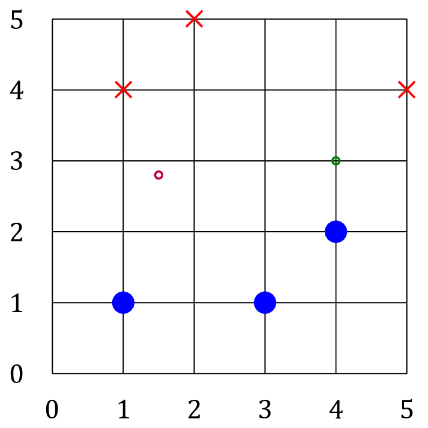
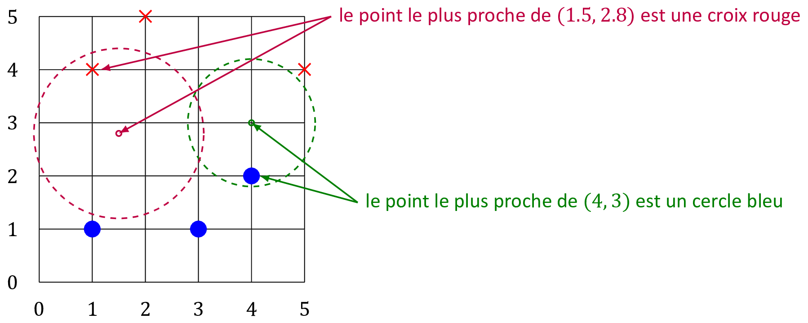

# Algorithme des k plus proches voisins

## 1\. Introduction

En intelligence artificielle, il est souvent nécessaire de savoir
classifier un objet selon une liste de catégories connues.

Par exemple:

  - une image contient-elle un chat ou une voiture ?
  - un email qu’on reçoit contient-il du spam ou pas ?

Il existe de nombreux algorithmes pour faire cela.

L’un d’eux s’appelle *Algorithme des k plus proches voisins*
(*k-**N**earest **N**eighbors* en anglais ou *kNN*) où *k* est un nombre
entier strictement positif correspondant au nombre de voisins.

## 2\. Principe du 1-NN

On considère un ensemble de \(n\) objets
\(E = \{ o_1, o_2, ..., o_n \}\) dont on connaît la *classe* \(c(o_1)\),
\(c(o_2)\), … \(c(o_n)\).

On dispose d’une méthode de mesure de distance entre deux objets :
\(d(o_i,o_j)\).

On introduit un nouvel objet \(o\) et on souhaite lui attribuer une
classe selon l’algorithme suivant:

1.  Recherche de l’objet \(o_i\) (pour \(i\) entre \(1\) et \(n\)) qui
    est le plus proche de \(o\).

2.  Attribution de la classe \(c(o_i)\) à \(o\).

Remarque : la recherche de l’objet le plus proche de \(o\) consiste à
trouver le minimum dans une liste de nombres réels correspondant à la
distance entre \(o\) et chacun des objet de l’ensemble \(E\).

``` python
Fonction classe_1nn(o)
    
    distance_min = Infini
    voisin = Nul

    Pour j allant 1 à n:
        distance = d(o,o_j)
        Si distance < distance_min Alors
            distance_min = distance
            voisin = o_j
        FinSi
    FinPour

    Renvoyer c(voisin)
```

*Exemple :* Dans la figure ci-dessous, on connait la classe de 6 points
(les cercles pleins bleus et les croix rouges)

On souhaite classer les points \((4,3)\) et \((1.5,2.8)\)

 

Pour les deux points à classer, on cherche parmi les points connus celui
qui est le plus proche (= 1 voisin)

 

  - \((4,3)\) doit être classé “cercle bleu”
  - \((1.5,2.8)\) doit être classé “croix rouge”

Exercices n°1 question 1, n°2 et n°3 de la feuille d’exercices.

## 3\. Principe du k-NN

Le contexte de travail est le même que pour l’algorithme 1-NN, mais on
procède de la façon suivante :

1.  Parmi les \(n\) objets de \(E\), on recherche les \(k\) voisins les
    plus proches de \(o\).

2.  Parmi ces \(k\) voisins, on compte les effectifs de chaque classe et
    on attribue à \(o\) la classe majoritaire.

Remarque : dans le cas d’égalité d’effectifs entre deux classes, la
classe attribuée dépendra de l’implémentation du point 2.

Algorithme naïf : on suppose

  - qu’on dispose d’une fonction distance\_max(objet, liste) renvoyant
    la plus grande distance entre un objet et les objets de la liste
  - qu’il n’y a que deux classes d’objets *c1* et *c2*

<!-- end list -->

``` python
Fonction k_voisins(o)
    Pour j allant 1 à k:
        ajouter o_j à voisins
    FinPour

    dmax = distance_max(o, voisins)

    Pour j allant k+1 à n:
        distance = d(o,o_j)
        Si distance < dmax Alors
            Enlever le voisin le plus éloigné de o
            Ajouter o_j à voisins
            dmax = distance_max(o, voisins)
        FinSi
    FinPour

    Renvoyer voisins

Fonction classe_knn(0)
    voisins = k_voisins(o)
    effectif_c1 = 0
    effectif_c2 = 0

    Pour objet dans voisins:
        Si c(objet) = c1
            Augmenter effectif_c1
        Sinon
            Augmenter effectif_c2
        FinSi
    FinPour

    Si effectif_c1 > effectif_c2
        Renvoyer c1
    Sinon
        Renvoyer c2
    FinSi
```

Exercices n°1 questions 2 et 3, n°4 et n°5 de la feuille d’exercice
